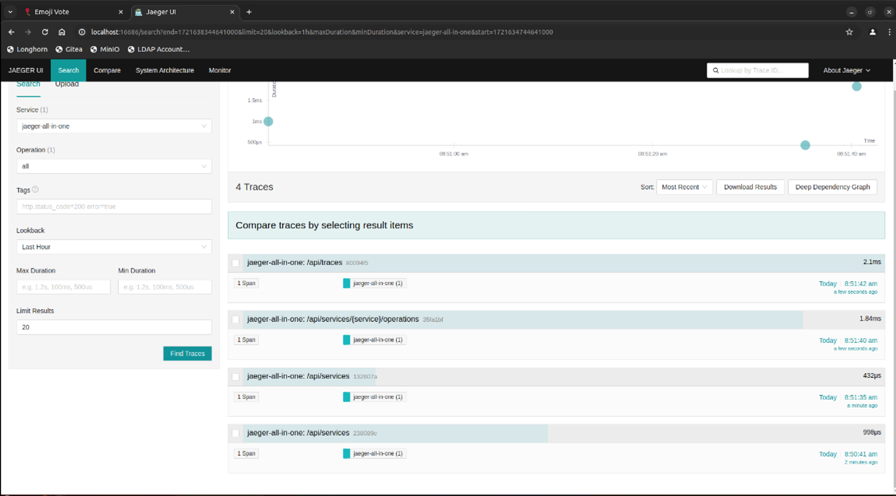

# 04 - Automatic Istrumentation

Go is a generic open source programming language. Also known as Golang, it was developed by Google before becoming open source and receiving support from a large number of contributors. Go is a language loosely inspired by C, statically typed, and features fast compilation.

OpenTelemetry Zero-Code refers to a set of techniques and tools that allow OpenTelemetry to be integrated into applications without having to modify the source code of the application itself. This approach is particularly useful for legacy applications or situations where modifying the code is not practical or possible.

## Components of OpenTelemetry Zero-Code 

- **Self-instrumentation**: Uses tools or agents that automatically insert telemetry code into applications. This can be done via:
  - **Build tools**: Plugins for build tools such as Maven, Gradle, or sbt that automatically add OpenTelemetry libraries.
  - **Runtime agents**: Agents that attach to the application process at runtime (e.g., Java agents such as “javaagent”, Python agents such as “opentelemetry-instrument”).

- **External configuration**: Allows OpenTelemetry to be configured via configuration files, environment variables, or configuration management tools without changing the source code.
  - **Environment variables**: Define variables that configure OpenTelemetry components (e.g., trace exporters, sampling rate).
  - **Configuration files**: Use YAML, JSON, or other formats to define how and where to export telemetry data.

- **SDK and Exporter Plug-in**: Modules that implement the logic for collecting and exporting telemetry data. They can be configured without modifying the application's source code, integrating via self-instrumentation and external configuration.

# Advantages of the Zero-Code Approach

The Zero-Code approach, particularly in the context of integrating monitoring solutions like OpenTelemetry, provides several significant benefits. This approach minimizes the need for manual coding changes and offers a range of advantages for both developers and organizations.

### 1. **Reduced Time and Effort**

   - **Eliminates Source Code Modifications:** The Zero-Code approach does not require changes to the source code, which significantly reduces the time and effort needed for integration. This is particularly beneficial for teams with tight deadlines or limited resources.
   - **Streamlined Integration:** By leveraging pre-built tools and configurations, monitoring solutions can be integrated more quickly and efficiently, avoiding the complexities associated with traditional coding approaches.

### 2. **Ease of Adoption**

   - **Non-Invasive Integration:** Allows monitoring tools like OpenTelemetry to be introduced into existing applications without making invasive changes. This non-intrusive method makes it easier to adopt monitoring solutions in both new and legacy systems.
   - **Simplified Deployment in Enterprise Environments:** Enterprises with large and complex systems benefit from the Zero-Code approach as it minimizes disruption during the integration of monitoring solutions. This is particularly useful in environments where stability and continuity are critical.

### 3. **Flexibility**

   - **Dynamic Configuration Changes:** External configurations enable users to adjust monitoring behavior and parameters without needing to recompile or redeploy the application. This flexibility allows for real-time adjustments and optimizations based on evolving needs and requirements.
   - **Adaptability to Different Scenarios:** Users can modify monitoring settings and features through configuration files or dashboards, providing the ability to tailor monitoring solutions to specific use cases and operational conditions.

### 4. **Compatibility**

   - **Support for Multiple Languages and Environments:** The Zero-Code approach is designed to be compatible with a wide range of programming languages and execution environments. This is achieved through the use of language-specific agents and integrations that work seamlessly across different platforms.
   - **Cross-Platform Integration:** The ability to work with various programming languages and environments ensures that organizations can deploy monitoring solutions consistently across diverse systems and technologies, enhancing overall system visibility and performance tracking.


## Deploying the GO Application “emojivoto”

First, load the folder containing the application written in the GO language into the environment with the following command:

```sh
git clone https://github.com/open-telemetry/opentelemetry-go-instrumentation.git
```

Once this is done, you will have the ‘emojivoto’ application and everything it needs to function within the environment. ‘emojivoto’ is an application that shows you various emojis and allows you to vote on which one is your favorite, then shows you which ones are the most popular.

Run the following command:

```sh
kubectl apply -k emojivoto/
```

This command applies the Kubernetes configurations defined in the “emojivoto/” directory using Kustomize to manage and orchestrate resources in a modular and flexible manner.

## Deploying Jaeger UI

### Overview of Jaeger UI

Jaeger UI is a powerful tool for monitoring and analyzing distributed applications. It provides a range of features that help developers and engineers understand how requests traverse their systems, identify bottlenecks, and optimize application performance.

### Key Features of Jaeger UI

1. **Tracing Dashboard**

   - **Trace Overview:** Displays a list of recent traces and an overview of their key metrics, such as total duration and the number of spans.
   - **Trace Search:** Allows searching for traces based on criteria such as service name, start time, and other attributes. Users can input a time range and filters to refine the search.

2. **Trace Visualization**

   - **Trace Details:** Once a trace is selected, Jaeger UI shows the details of that specific trace. This includes a graph or table view of the spans and their relationships.
   - **Trace Graph:** Visualizes the relationships between spans as a node-and-edge graph, showing how requests traverse various services. Spans represent individual operations and their durations.
   - **Span Details:** Provides detailed information about each span, including start and end times, operation names, attributes, and annotations. Users can explore specific data for each span.

3. **Advanced Filtering and Search**

   - **Service Filters:** Users can filter traces by service, displaying only those traces involving specific services.
   - **Time Filters:** Allows setting time ranges for data visualization, facilitating performance analysis over specific periods.
   - **Tag Filters:** Users can filter traces based on tags or specific attributes associated with spans, such as request IDs or HTTP status codes.

4. **Performance Analysis**

   - **Latency Distribution:** Shows the distribution of request latencies over time, displaying the percentage of requests falling within specific time intervals.
   - **Heatmaps:** Displays performance heatmaps to highlight areas of higher latency and identify bottlenecks.
   - **Metadata and Metrics:** Integration with monitoring tools to visualize additional metadata and metrics, such as CPU usage or memory.

5. **Error Exploration**

   - **Errors and Exceptions:** Shows information about errors and exceptions that occurred during request tracing. Users can analyze specific errors to determine underlying causes.
   - **Error Tags:** Spans that generated errors can be marked with distinctive tags or colors to make them easier to identify.

6. **Interaction and Navigation**

   - **Zoom and Pan:** Users can zoom and navigate within the trace graph to explore details of various spans and their relationships.
   - **Contextual Details:** Provides contextual details when hovering over spans or nodes in the graph, making it easier to understand the trace structure without clicking.

### How to Use Jaeger UI

   - **Access:** Access Jaeger UI via a web browser using the Jaeger server URL.
   - **Service Selection:** Select the service of interest from the list of available services.
   - **Time Settings:** Set the time range to view traces collected during that period.
   - **Search and Filter:** Use search and filter options to find specific traces or to view span details.
   - **Data Analysis:** Explore the trace graph and span details to analyze performance and identify potential issues.


Install Jaeger UI by running:

```sh
kubectl apply -f jaeger.yaml -n emojivoto
```

## Instrumentation

Apply the automatic instrumentation to the emoji, voting, and web applications by executing the following command:

```sh
kubectl apply -f emojivoto-instrumented.yaml -n emojivoto
```

## Perform Actions on the Target Application

Run the following command:

```sh
kubectl port-forward svc/web-svc 8080:80 -n emojivoto
```

This command creates a port forwarding tunnel between the Kubernetes “web-svc” service in the “emojivoto” namespace and the local machine, redirecting requests from local port 8080 to port 80 of the service in the Kubernetes cluster.

Go to [http://localhost:8080](http://localhost:8080), and click the **view the leaderboard** button.

## Viewing the Traces

First, port forward to the Jaeger UI:

```sh
kubectl port-forward svc/jaeger 16686:16686 -n emojivoto
```

Then, open the Jaeger UI in your browser by navigating to [http://localhost:16686/](http://localhost:16686/)

After selecting the `jager-all-in-one` (emojivoto-web service), you should see the following traces:



Each time you choose a new emoji from the application, refresh the Jaeger page to see that the information is analyzed by the program and sent in the form of a trace.

## **Conclusion**

Observing and analyzing the traces that we can visualize in Grafana UI is crucial for several reasons. This data allows us to understand where and how to improve our application, as well as to identify any issues that may impact performance and user experience. Here are some specific scenarios where this information proves particularly useful:

- **Managing Multiple Requests:**
  Suppose we have a page on the site receiving many requests. By using Grafana UI, we can graphically observe the number of requests received over a given period. If we notice a volume of requests that exceeds what our site can handle, we can intervene to increase the site's maximum capacity, ensuring it can manage a higher number of requests without compromising performance. This type of analysis helps us prevent downtime or slowdowns that could negatively affect the user experience.

- **Identifying Under-visited Pages:**
  By analyzing the trace data, we can identify pages or products on our site that receive few requests. This information is crucial for strategic decisions. For instance, a page with few visits might indicate an issue with user interest or visibility. In such cases, we can invest in marketing campaigns to drive more traffic to that specific page or product. This targeted intervention allows us to optimize resources and increase user engagement.

- **Identifying Bottlenecks:**
  Observing traces also helps us identify potential bottlenecks in our system. If a particular operation or service takes longer than expected, we can examine the traces to determine where the delay occurs and intervene to optimize the code or improve the infrastructure. For example, it might be necessary to optimize a database query or reduce the latency of an API call.

- **Performance Monitoring:**
  Using Grafana UI, we can monitor the performance of our application in real time. This allows us to immediately detect any anomalies or issues, such as a sudden increase in latency or a rise in errors. By intervening promptly, we can minimize the impact on our users and maintain high levels of service.
